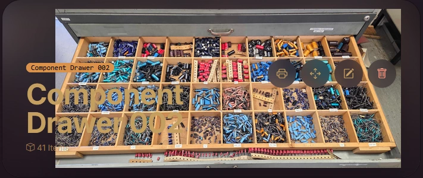
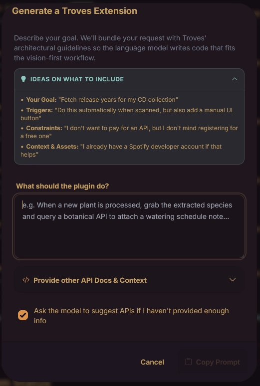

# 📦 Troves


Inventory management (for at home). There are many like it, but this one is mine.

My primary use-cases are:

1. `Do I have that? Now, where the heck is it?`
2. `What does it do and why did I buy it?`

There is also that primal satisfaction in simply admiring my stuff; swimming through a hoard of tools, books, and components like Scrooge McDuck. This is a digital equivalent: inspect and appreciate your sh*t without having to drag 20 boxes out of the attic.

[There](https://youtu.be/5B0cxLwS8fo) might [be](https://youtu.be/8WpgqJUO7SQ) a [bunch](https://youtu.be/n4YAiE8Yv5Y) of [demo](https://youtube.com/shorts/qyyXUC3TYlg?feature=share) videos [uploaded](https://youtube.com/shorts/U_juc8A-QqI?feature=share) to [YouTube](https://youtube.com/shorts/JtorL9VRztQ?feature=share). Oh, and there are also [some here](https://www.youtube.com/@friya/shorts). 

<table align="center">
  <tr>
    <td align="center" width="300">
        <a href="https://www.youtube.com/shorts/P1S-qs7-n8E">
          
        </a>
    </td>
  </tr>
  <tr>
    <td align="center" width="300">
        <i>
          <a href="https://www.youtube.com/shorts/P1S-qs7-n8E">
            ...this one is pretty fun, for instance
          </a>
        </i>
    </td>
  </tr>
</table>


I hate data-entry. Creating an inventory and adding new items should be as automated as humanly possible. Most of the effort in Troves went into creating a pleasant, frictionless workflow so you actually use it. Under the hood, it uses object classification, OCR, background removal, color extraction, vision, audio, and language models to do the heavy lifting.

Just snap a picture, or paste in a URL and let the system organize it.

**Troves is VERY much in a BETA phase. It's VERY untested. There be bugs and dragons and trolls. You were warned. That said, it's under active development and code contributions are more than welcome!**


## 📸 The Core Workflow
<table align="right">
  <tr>
    <td align="center" width="300">
        <i>
            <i>This demonstrates the <a href="./docs/extensions/04-examples.md">Spotify mod</a> during bulk import of CDs</i>
        </i>
    </td>
  </tr>
  <tr>
    <td align="center" width="300">
        
    </td>
  </tr>
</table>

To add an item, grab your phone, take a picture, and scan the QR-code on the container you want to place it in. That's it.  

That said, if you're feeling ambitious, you can:
* Take a picture of an invoice or receipt (Troves will figure out the juicy bits).
* Add additional photos or just paste in web links.
* Scan QR-codes containing URLs to relevant documents.
* Manually type tags, amounts, and descriptions (but then you are *very* ambitious).
* **Just Paste Anything:** Hit `Ctrl+V` anywhere. The global PasteHandler detects images in your clipboard, raw URLs (fetching the webpage), text blocks (creating local Markdown notes). Well, Key-Value Pairs and lists (weight/color/size) in all varieties are picked up, mapping them to attributes.
* **Fire-and-Forget Outbox:** `Never` wait for a progress bar. Tapping 'Save' pushes the item to an offline-tolerant IndexedDB queue and resets the UI. You can scan items in a deep basement with no signal, and the app will sync whenever your Wi-Fi reconnects. ... Okay, okay, I will backpedal on `never` since we sometimes have to verify bulk stuff.

**Bulk Import & The Comparison Lens**  
If bulk import is how you ingest a mountain of data into Troves, the Comparison Lens is how you compare reality against your database. *(Tip: Count the physical items before snapping a multi-scan photo. It gives you a quick sanity check to know if your picture was clear enough for the model to catch everything).*

* **Flea Market Scan ($A \setminus B$)**  
Snap a photo of a crate of 40 CDs or books to see what is **✨ New to You** and what is already **✓ In Your Trove**.

* **Kit Check ($B \setminus A$)**  
Dump your stuff on a table, scope the comparison to the `#camping-gear` tag, and snap a photo to see exactly what you forgot to pack (a bit of a contrived example, but ah...).

**⚠️ The Comparison Lens is VERY much BETA. More than the rest of the system, expect quirks and dragons here!**

## 🧠 Self-Organizing Taxonomy

Because Troves has to handle everything, from winter coats to spark plugs to whiskey to trollbeads to ESP32 boards, it can't be pre-programmed with rigid spreadsheet columns like "Brand" or "Shoe Size." Instead, it creates, destroys (and updates) its own structure on the fly using an Entity-Attribute-Value taxonomy. There's a bit more to it, but that is the idea.

**Keeping the language consistent**  
Image-recognition tools are messy. If you feed the system photos of three different t-shirts, they get labelled "short sleeves", "arm style", and "sleeve length". You can't build a useful search tool out of that. To fix this, Troves maintains a dynamic baseline. Once it learns the concept of "sleeve length" for a category, it reuses that term for future items instead of inventing synonyms. The schema still evolves naturally as new features appear, but it stops the model from having different names for the same thing. This is the idea, anyway. There's still some work to do here. (Mildly related: empty categories just vaporize to keep things tidy).

**Spotting duplicates from photos**  
A jacket dumped on a bed today looks completely different from the same jacket hanging in a closet months ago. Without barcodes to fall back on, Troves cross-references the visual traits and the parsed text to figure out if you already own it. It catches the duplicates, without confusing two completely different blue shirts. 

Clothes are used in these examples mostly because everyone can relate to it, but this works for whatever type of item you throw at it. Maybe.

### Expect the classification to fail
A quick warning: go into this assuming the automatic classification will just get your items wrong.  

For me, it actually nails it about 95% of the time without me typing a single word. But that's exactly the trap. It works just often enough that you get completely spoiled, and then you get genuinely annoyed when it looks at a logic analyzer and confidently labels it a "black plastic box."

Tweaking the data manually is normal. The whole workflow is built around making it completely frictionless to fix a bad guess or nudge the model in the right direction. Just let the scanner do the dumb heavy lifting to get the item into the system. Digging up the exact specs, attaching PDFs, and nerding out over the details later is actually quite pleasant, since you can just do it from the couch whenever you feel like it.

*Note:* Is the classification wrong? Look for the ✨ Sparkle icon at ... various places. Click it to provide a hint (e.g. "It's an IKEA MITTZON desk") to nudge it. 


## 🗺️ Spatial Mapping vs. Semantic Tagging

When assigning a location to an item, Troves gives you a fork in the road depending on what you are storing.

**Option A: Semantic Tagging (Text/QR)**  
You type or scan a name (e.g., "Garage Shelf 2" or "Moving Box A"). When you search for the item later, Troves just prints the text.
*Best for: Macro items. Coats, circular saws, book boxes. You don't need a treasure map to find a chainsaw on a shelf.*

**Option B: Spatial Mapping (Visual Grid)**  
You snap an overhead photo of an open drawer, Gridfinity layout, or wine rack. You define the grid in the UI. Then, Troves asks, "Tap where it goes."
*Best for: Micro items. Resistors, screws, Lego parts. It bypasses the need to read tiny labels on 40 identical hardware trays.*

**Deep Scan Grid**  
If you don't want to tap 60 times, hit ✨ Deep Scan. The Vision Model analyzes the entire drawer in one go, reading printed labels and identifying the physical components in each specific slot. Troves then opens a "Triage" screen where you step through the results, verify the model's guess, and accept it into your inventory.

**⚠️ Important Note on Medication**  
Please do **NOT** use the automatic indexing, spatial mapping, or LLM-based label reading for organizing medication, drugs, or hazardous materials. Vision and Language models are eager servants and can easily misread dosages and labels. Rigorous human proof-reading is always required.


## 🗣️ Hardware-Aware Voice Search

The search field supports voice dictation parsed by a custom NLP engine. Ask natural questions to locate things ("Find my grey jeans" or "Where is the USB to TTL converter?"), check stock ("How many BNCQ9 connectors do I have?"), or group items ("List my microcontrollers").

Standard NLP stemmers usually destroy alphanumeric model numbers. Troves' engine explicitly rescues tokens containing digits, ensuring terms like `ESP32`, `LM317`, or `1k` survive. It also uses bidirectional unit translation, meaning if you say "10 microfarad", it perfectly matches the `10µF` stored in your database.

You can test the intent parser without a microphone by prefixing your search with `/v ` (e.g., `/v where are my 10k ohm resistors?`).

**Extending to Other Domains**  
Because the Voice Engine relies on dictionaries and regular expressions rather than rigid database schemas, extending it to entirely different troves (like a wardrobe or wine cellar) is trivial. You just expand the pre-processing maps in `VoiceEngine.ts` to add domain-specific phonetics (e.g., mapping `Cab Sauv` to `Cabernet Sauvignon` or expanding `32x34` to `waist 32 length 34` for TTS) and custom intent triggers.


## 📚 The Knowledge Base (Link-Rot Prevention)

Troves isn't just for physical junk. It also hoards your digital files, manuals, datasheets, and notes, so you actually remember how to use the things you bought.

* **Offline Archives**  
Never run into a dead link again. If you link to a webpage, manual, or spec sheet, Troves downloads, parses, summarizes, and archives it locally on your disk. (Scraping is restricted to 1-level depth to prevent infinite spidering).
* **Digital Reader & EPUB Sync**  
Drop an EPUB or PDF into an item, and Troves extracts the cover art. The built-in reader saves your exact scroll position across sessions. Highlighting text inside an EPUB syncs that quote and the surrounding chapter context to the Trove's Notebook.
* **Video Archiving**  
Paste a link to YouTube, Twitter, Reddit, or TikTok, and Troves uses `yt-dlp` in the background to physically download the video and archive it forever alongside your item.

## 🔍 Actually good searching for items and documents

Search in most local apps is an afterthought. Troves uses SQLite Full Text Search (FTS) across the entire database, going far beyond standard title and tag matching.

* **Document Indexing**  
If you attach a PDF manual, EPUB, or webpage to an item, Troves parses and indexes the text. It means you're searching through the actual contents of your documents, not just item titles and tags.

* **Fuzzy Search Toggles**  
Search stemming is great for tools, but infuriating when it floods an apparel search with false positives. You can toggle "Fuzzy Word Search" off per-trove for strict, exact-match queries.
* **Spatial Context**  
Search results return the exact container, nested tray, and (visually) grid slot it currently occupies. Or in documents, the exact location of the text.

## 🔌 Extensions & Modding


Modding is fun. You get to feature-creep and add bloat without consequences.

Troves supports a drop-in, zero-config plugin architecture. If you want to ping a Discord webhook, print physical labels to a custom thermal printer, or look up components from the Mouser API, just drop a `.js` file into the `data/plugins/` directory (or write it directly in the Admin dashboard).

The Extension Engine handles asynchronous routing, offline queuing, and secure environment variable injection, and supports hot-reloading plugins without server restarts.

Can't be bothered to read the docs? The Admin dashboard includes a built-in prompt generator. Just type what you want the plugin to do, and Troves will package your idea along with all the necessary architectural context and API rules into a massive prompt. Just paste it into your favorite LLM and let it write the extension for you.

Check out the [Extensions Documentation](docs/extensions/01-architecture.md) to write your own.

Or ... just use one of the already available extensions: [Spotify](docs/extensions/99-more-examples/spotify-music-enhancer.js), [Google Books](docs/extensions/99-more-examples/google-books-enhancer.js), [Mouser](docs/extensions/99-more-examples/mouser-spec-downloader.js), [Vinted](docs/extensions/99-more-examples/vinted-detailed-search-scout.js), [etc](docs/extensions/99-more-examples/).

⚠️ SECURITY HEADS-UP: Extensions execute in the core server context. They have unrestricted access to .env variables, database, and local filesystem. Only install extensions you verified yourself or from sources you trust. Installing a malicious plugin is equivalent to giving your server away.

## 🔒 Privacy, Transparency & BYOM

**Completely Free (If you want it to be)**  
You do not need expensive subscriptions to run Troves. The free tiers for Google Gemini (15 requests/min) and Groq are generous and completely sufficient for a normal household. I have not paid a single cent during my use or development.

**Bring Your Own Model & Granular Routing**  
Troves supports any OpenAI-compatible API (Ollama, LM Studio, vLLM) alongside native Groq and Gemini. You aren't restricted to a single model per modality. You can map specific cognitive tasks via `.env` overrides: route `AI_TEXT_PARSER` to a free local Ollama instance for background JSON structuring, while pointing `AI_TEXT_SUMMARY` to Groq for fast webpage summaries.

**Multiple Isolated Databases**  
You aren't forced into one giant bucket. You can run completely separate, isolated inventories (e.g., one for shoes, another for clothes, and a strict one for electronics).

**The `NO_THIRD_PARTY_SERVICES` Flag**  
I really dislike it when I have to register for 3rd-party services to try software. If you set `NO_THIRD_PARTY_SERVICES = true` in your `.env` file, you can use the core app entirely offline without any API keys (though adding new items will require more manual entry).

**All your data is completely yours and sits securely on your own device.**  
Your entire database runs from a single, portable SQLite file, and all photos/documents are saved directly into your local upload folder. There are no tracking cookies, no forced accounts, and no vendor lock-in.

**Transparency**  
Troves offers full transparency over what is being sent to external APIs. In the `/activity` dashboard, you can view the exact data sent to the Vision model, its raw JSON responses, execution times, and possible token usage limits.


**📡 The "Feel-Good" Telemetry**  
I added a tiny ping to the backend that reaches out to my personal server (via CF proxy) when Troves boots up or gets installed. It’s only for my own sanity, it is incredibly motivating to know that other people are actually out there using your stuff. Whoever they might be.  

It sends the version and a scrambled instance ID (to make sure it's not the same Troves restarting 50 times). It absolutely does not send your IP (and your server's IP is dropped), inventory data, photos, or keys or anything else.  

*Verify it: The code for the ping is in `src/lib/server/telemetry.ts`, you can grep for `pingTelemetry` to see how and where it's called.*

That said, I totally get wanting your self-hosted software to stay completely quiet. If you want to opt out, just add `DISABLE_FEELGOOD_TELEMETRY="true"` to your `.env` file. It won't make a peep, no hard feelings!


## Some Screenshots
It's a couple of years overdue because I never really did anything about the visuals. But, let's get the ball rolling in 2026! The first screenshots:

<div>
    
    
    
    
    
</div>

<div>
    
    
    
    
    
</div>

<i>More <a href="./docs/Screenshots.md">screenshots</a> here</i>

---

## 🛠️ Installation & Setup

**Linux Installer**  
```bash
mkdir troves && \
    cd troves && \
    curl -fsSL https://raw.githubusercontent.com/romland/troves/main/bin/setup-host.sh -o setup.sh && \
    bash setup.sh
```

**⚠️ Hardware Heads-Up (Memory & SBCs)**  
If you are planning to run this on a cheaper Single Board Computer (like a Raspberry Pi): the background removal microservice needs RAM. It really wants around 8GB of it to run comfortably. If you try to spin Troves up on a 2GB or 4GB board, it will likely bring the system to its knees. If you are tight on hardware memory, you can simply turn off background removal in settings.

**Host Dependencies (Optional)**  
All external dependencies gracefully fall back if a tool isn't installed.

* `poppler-utils` (extracts PDF first pages as thumbnails)
* `ffmpeg` (extracts frame grabs from video files)
* `yt-dlp` (downloads linked videos)

**Local LAN HTTPS**  
Mobile browsers strictly require HTTPS to use the Camera or install the PWA to your home screen. Why go through the hassle of local certs instead of a Cloudflare Tunnel? Because of the "trombone effect." If you use an external tunnel, taking a photo sends the image out over your internet connection to a remote datacenter, just to bounce it right back to the server sitting 5 feet away from you. Cloudflare/others also impose hard limits on uploads, etc.

Run the included HTTPS setup script:

```bash
bash bin/setup-https.sh
```
Follow the instructions to install the generated `rootCA.crt` on your phone, generate the local `.pem` files, and your traffic remains fast, unrestricted, and completely offline.

### Uninstalling Docker Troves
If you want to completely remove Troves and its background microservices, run the included utility:
```
bash bin/uninstall.sh
```

### Deleting Native Troves (not Docker)
You should save the database and the data in `troves/prisma/dev.db` and `troves/data/`.

... after that:  
⚠️⚠️ You WILL lose your database and uploaded files if you have not saved them above! ⚠️⚠️  
*To remove everything including your database and uploaded photos, you can simply delete the directory: `rm -rf troves`.*


### ⚙️ Configuring and setting API keys in .env
Troves can function completely offline with manual data entry, but the real magic (automatic classification, vision scanning, etc) requires access to language and vision models. You see my personal preferences on which models and providers to use in `.env.example`.

The installer will rename the `.env.example` to `.env` in your `troves` directory. Open it and plug in your keys. 

You do **not** need paid subscriptions. I use the generous free tiers of Gemini (3.1-flash-lite) (for vision and image tasks) and Groq (for text summaries, receipt parsing and voice dictation).

1. **Gemini Key:** Grab a free key from [Google](https://aistudio.google.com/).
2. **Groq Key:** Grab a free key from the [Groq Console](https://console.groq.com/).

Just paste the keys into the base credentials section of your `.env` file:

```env
# ==========================================
# BASE CREDENTIALS (FALLBACK)
# ==========================================
GEMINI_API_KEY="AIza..."
GROQ_API_TOKEN="gsk_..."
```
*Note for power users: If you want to use local runners like Ollama or vLLM, you can scroll down in the `.env` file to override specific tasks (e.g., `AI_TEXT_PARSER`) with your local endpoint URLs.*

## Maintenance & Updates
To update Troves to the latest release, pull updates, and automatically rebuild/restart services:

```bash
./troves.sh update
```
**CLI Management**  
You can control the Troves service using the included `troves.sh` utility wrapper:
```
./troves.sh start         # Start all configured services
./troves.sh stop          # Stop running containers / processes
./troves.sh restart       # Restart the stack
./troves.sh update        # Pull latest updates and restart
./troves.sh update-ytdlp  # Hot-patch video downloader (if video archiving fails, do this)
./troves.sh logs          # Tail live application logs
```

*You don't have to restart anything if you run `update-ytdlp`, it's a hot-patch.*

## 💻 Development & Under the Hood
**Stack**  
Svelte 5, PWA, Prisma, SQLite, Tailwind, TypeScript, LLMs + various ML models.

**A Note on Terminology**  
While the UI refers to your top-level databases as "Troves", the underlying database schema still calls them "Inventories". Furthermore, the bulk camera feature is called "Multi-Scan" in the UI, but referred to as "Collections" in the code. I mention this because there is bound to be confusion if you start poking around the repo.

**Security Notice on Images**  
Troves serves uploaded images via a static file server rather than authenticating every single image request through the database. Security is achieved via obscurity using high-entropy UUIDs. This means anyone with the exact URL of an image can view it without logging in, but it is very (VERY!) hard to guess the URLs.

### Dev Setup
```bash
# 1. Clone the repo
git clone https://github.com/romland/Troves.git
cd troves

# 2. Setup environment
cp .env.example .env
npm install

# 3. Setup database
npx prisma migrate dev --name init
npx prisma db seed

# 4. Run dev server
npm run dev
```

### The ARRRGH's (dev troubleshooting)
This is for myself.

**Canvas Module Error**  
If you get `Error: Cannot find module '../build/Release/canvas.node'` after `npm install`:
```bash
cd node_modules/canvas
npx node-gyp rebuild
```

**Prisma Error**  
If you deleted `node_modules` and Prisma breaks:
```bash
npx prisma generate
```

**Updating yt-dlp**  
If video archiving stops working, YouTube (or whomever) likely changed their player. You will want to update yt-dlp, depending on your install type do either of these two:  

* **Troves Docker**  
See **CLI Management** above.

* **Troves native**  
```bash
P="$(which yt-dlp)" && sudo wget https://github.com/yt-dlp/yt-dlp/releases/latest/download/yt-dlp -O "$P" && sudo chmod a+rx "$P"
```

*If you get a chance, go give some love to the people keeping `yt-dlp` updated.*.

## 💡 Hacks & Pro-Tips

* **Add it to your Home Screen**  
I highly recommend using the "Add to Home Screen" button on your phone. Hiding the browser UI gives you back a ton of vertical space, and it just makes the whole thing much nicer to use.

* **The Pool Noodle Hack ($2)**  
When scanning clothes, especially if you use the background removal feature, limp sleeves and hanger-pokes ruin the cutout. Slit a dense foam pool noodle down the side and slide it over the top bar of a standard wooden hanger. It immediately widens the shoulder profile.

* **iOS Safari Share Workaround**  
Apple does not support the Web Share Target API for PWAs. To share things into Troves on an iPhone, build a quick iOS Shortcut that accepts URLs/Images, URL-encodes the input, and opens `https://[your-troves-ip]/timeline?pasteText=[Encoded Input]`.

* **System Diagnostics**  
If something breaks, check `/settings/admin` to run a self-diagnosis on host tools, Docker microservices (RemBG, OCR), and API configurations.

* **Photo-Level Categories**  
Need an item to exist in two categories? Give it multiple photos and assign a different category to each. The engine resolves categories at the photo level. (This also means changing a category requires opening the image lightbox and using the "..." menu there).

* **Quick Notes**  
Long-tap the Notebook button to add a quick note without leaving your current context.

* **Count the items**  
So, we all know generative models can be a bit ... excited. If you are doing large multi-cans (dozens of items), a good way to make sure you and the model are on the same page is to count the items before scanning. It'll give you an idea during triage if you had a good enough picture.

* **BTW, regarding that IKEA Mittzon**  
It's actually a damn fine desk! It took a while to assemble, but I am quite happy with it! ... or well, I lost the battle, so my better half is.


## 📌 My Personal Setup (TODO, flesh this out)
*Document how I actually use this day-to-day:*
* Which thermal label printer I use.
* Which hardware cabinets and organizers I rely on.
* Pictures of my physical containers.
* The Firefox QR-code generator extension I use for current links.
* Which fields I actually bother filling in vs. automated.
