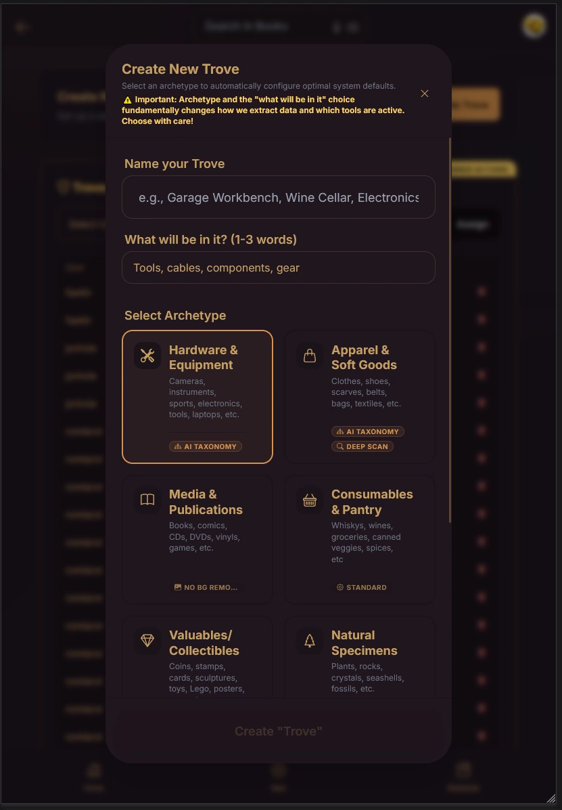
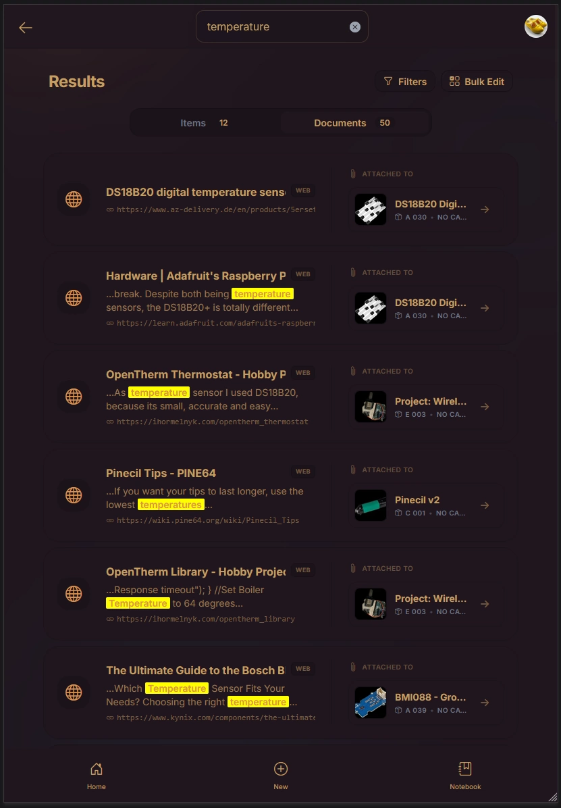
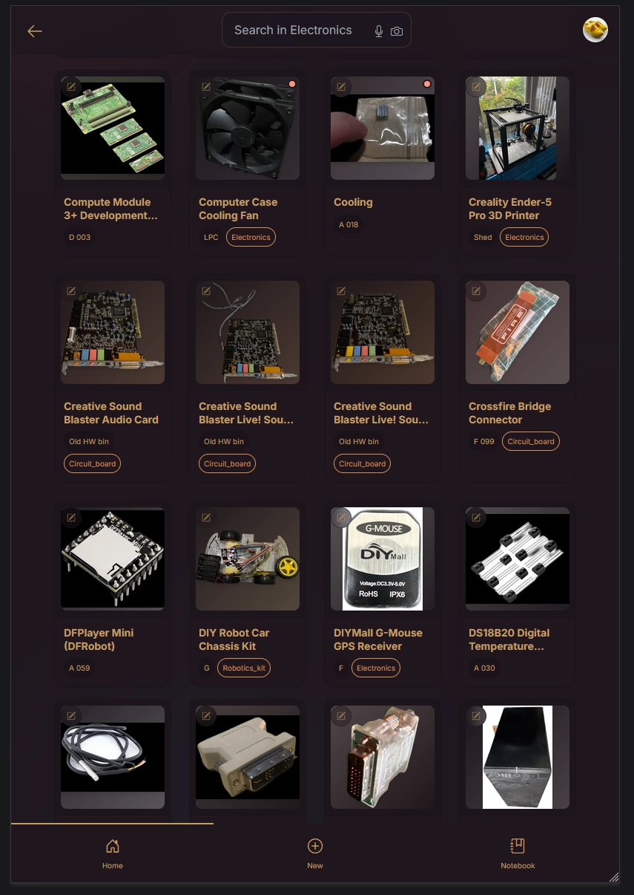
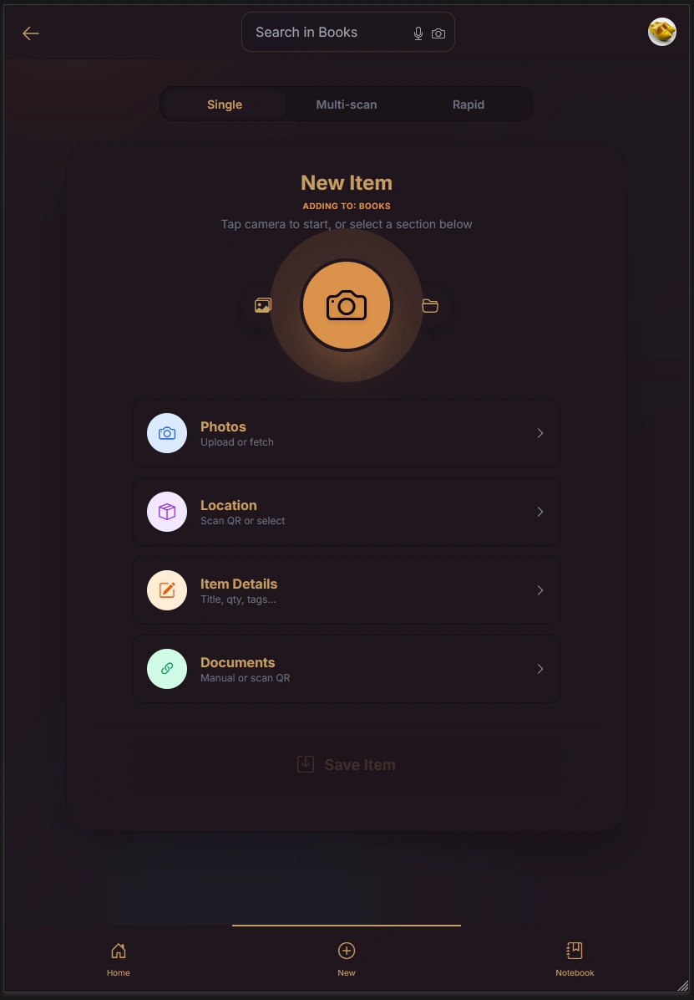
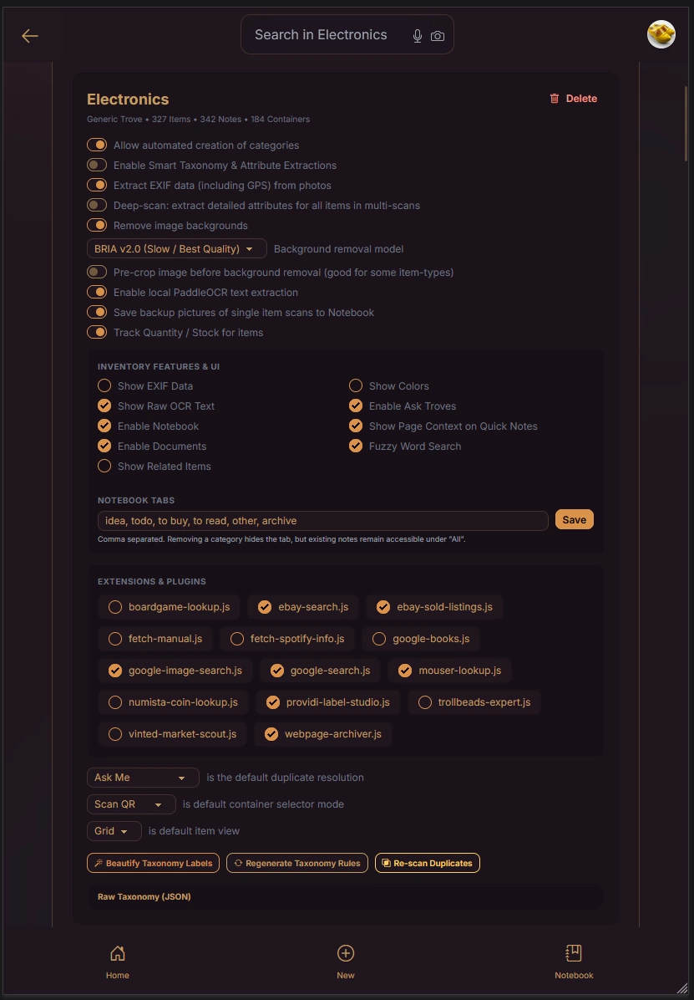
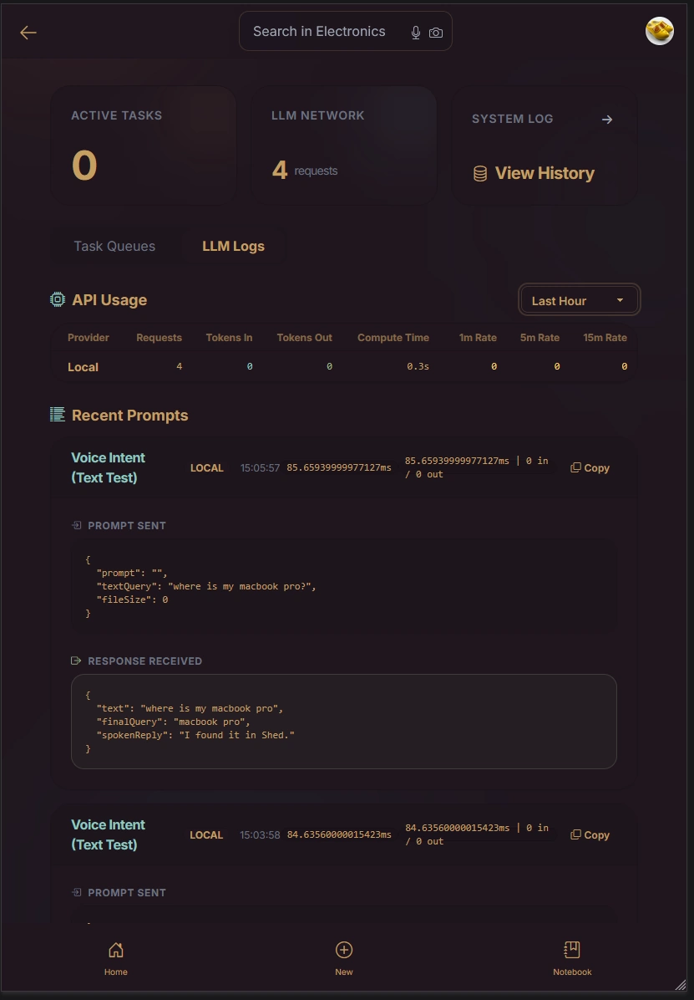
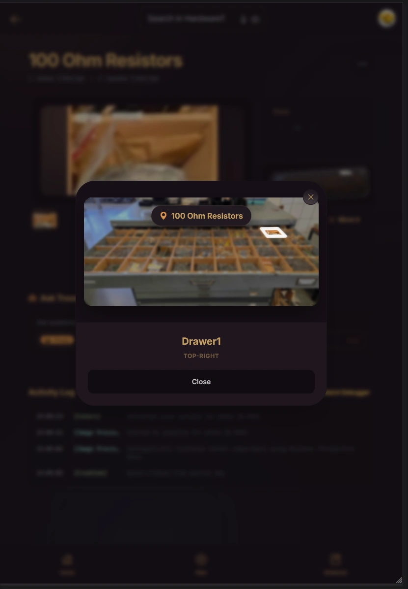
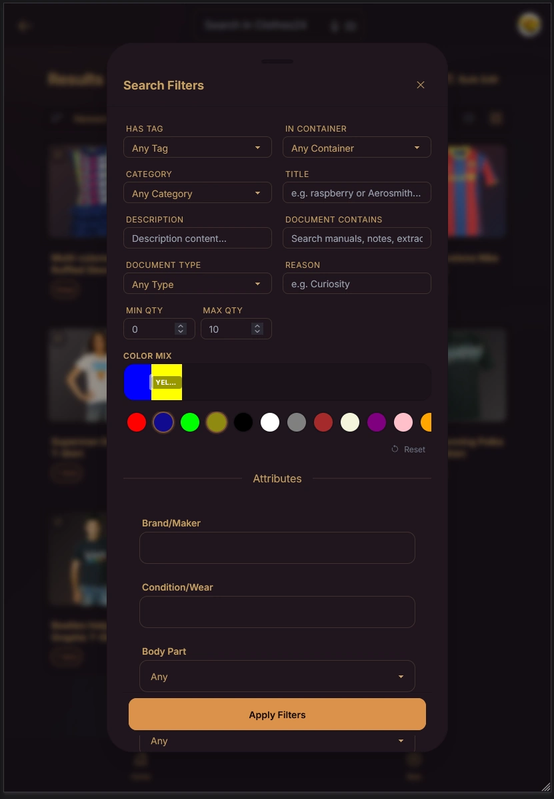
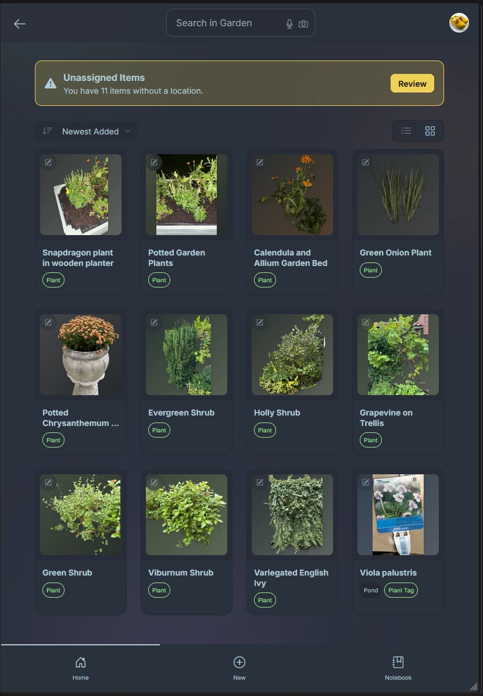

# 📦 Troves


Inventory management (for at home). There are many like it, but this one is mine.

My primary use-cases are:

1. `Do I have that? Now, where the heck is it?`
2. `What does it do and why did I buy it?`

There is also that primal satisfaction in simply admiring your stuff; swimming through a hoard of tools, books, and components like Scrooge McDuck. This is a digital equivalent: inspect and appreciate your shit without having to drag 20 boxes out of the attic.

I absolutely hate data-entry. Creating an inventory and adding new items should be as automated as humanly possible. Most of the effort in Troves went into creating a pleasant, frictionless workflow so you actually use it. Under the hood, it uses tools like object classification, OCR, background removal, vision, audio and language models to do the heavy lifting, but the interface gets out of your way.

Just snap a picture, or paste in a URL and let the system organize it.

[There](https://youtu.be/5B0cxLwS8fo) might [be](https://youtu.be/8WpgqJUO7SQ) a [bunch](https://youtu.be/n4YAiE8Yv5Y) of [demo](https://youtube.com/shorts/qyyXUC3TYlg?feature=share) videos [uploaded](https://youtube.com/shorts/U_juc8A-QqI?feature=share) to [YouTube](https://youtube.com/shorts/JtorL9VRztQ?feature=share).

## 📸 The Core Workflow
<table align="right" width="30%">
  <tr>
    <td align="center">
        <i>
            <i>This demonstrates the <a href="./docs/extensions/04-examples.md">Spotify Extension</a> during bulk import of CDs</i>
        </i>
    </td>
  </tr>
  <tr>
    <td>
        
    </td>
  </tr>
</table>

To add a product, grab your phone, take a picture, and scan the QR-code on the container you want to place it in. That's it.  

That said, if you're feeling ambitious, you can:
* Take a picture of an invoice or receipt (Troves will figure out the juicy bits).
* Add additional photos or just paste in web links.
* Scan QR-codes containing URLs to relevant documents.
* **Just Paste Anything:** Hit `Ctrl+V` anywhere. The global PasteHandler detects images in your clipboard, raw URLs (fetching the webpage), text blocks (creating local Markdown notes), and even raw Key-Value Pair lists (weight/color/size), mapping them to attributes.
* **Fire-and-Forget Outbox:** Never wait for a progress bar. Tapping 'Save' pushes the item to an offline-tolerant IndexedDB queue and resets the UI. You can scan items in a deep basement with no signal, and the app will sync whenever your Wi-Fi reconnects.

**Bulk Import & The Comparison Lens**
If bulk import is how you ingest a mountain of data into Troves, the Comparison Lens is how you audit reality against your database using set math.

* **Flea Market Scan ($A \setminus B$):** Snap a photo of a crate of 40 CDs or books to see what is **✨ New to You** and what is already **✓ In Your Trove**.
* **Kit Check ($B \setminus A$):** Dump your stuff on a table, scope the comparison to the `#camping-gear` tag, and snap a photo to see exactly what you forgot to pack (a bit of a forced example, but ah, why not...).


## 🧠 Self-Organizing Taxonomy

Because Troves has to handle a bit of everything, from winter coats to spark plugs to whiskey to trollbeads to ESP32 boards, it can't be pre-programmed with rigid spreadsheet columns like "Brand" or "Shoe Size." Instead, it creates, destroys (and updates) its own structure on the fly using an Entity-Attribute-Value taxonomy. There's a bit more to it, but that is the idea.

**Keeping the language consistent:**
Image-recognition tools are naturally messy. If you feed the system photos of three different t-shirts, it might label one with "short sleeves," another with "arm style," and a third with "sleeve length." You can't build a useful search tool out of that. To fix this, the first time the app sees a new category, it locks in a specific set of labels and forces the software to reuse those exact terms for all future items. It turns messy, fluid text into a clean, predictable database.

**Spotting duplicates from photos:**
If you take a picture of a jacket on your bed today, the lighting and folds will look completely different than when you first logged it hanging in a closet months ago. To handle this, Troves cross-references the visual details and the text to figure out if it's the same item, ensuring it doesn't log a duplicate or confuse two completely different blue shirts.

*Note:* Does the vision model sometimes guess wrong? Look for the ✨ Sparkle icon next to the title. Click it to provide a hint (e.g. "It's an IKEA MITTZON desk") to nudge the classification. Empty categories vaporize if you move the last item out of them, keeping your database clean.


## 🗺️ Spatial Mapping vs. Semantic Tagging

When assigning a location to an item, Troves gives you a fork in the road depending on what you are storing.

**Option A: Semantic Tagging (Text/QR)**
You type or scan a name (e.g., "Garage Shelf 2" or "Moving Box A"). When you search for the item later, the app just prints the text.
*Best for: Macro items. Coats, circular saws, book boxes. You don't need a treasure map to find a chainsaw on a shelf.*

**Option B: Spatial Mapping (Visual Grid)**
You snap an overhead photo of an open drawer, Gridfinity layout, or wine rack. You define the grid in the UI. Then, the app asks, "Tap where it goes."
*Best for: Micro items. Resistors, screws, Lego parts. It bypasses the need to read tiny labels on 40 identical hardware trays.*

**Deep Scan Grid:**
If you don't want to tap 60 times, hit ✨ Deep Scan. The Vision Model analyzes the entire drawer in one go, reading printed labels and identifying the physical components in each specific slot. Troves then opens a "Triage" screen where you step through the results, verify the model's guess, and accept it into your inventory.

## 🗣️ Hardware-Aware Voice Search

The search field supports voice dictation parsed by a custom NLP engine. Ask natural questions to locate things ("Find my grey jeans" or "Where is the USB to TTL converter?"), check stock ("How many BNCQ9 connectors do I have?"), or group items ("List my microcontrollers").

Standard NLP stemmers usually destroy alphanumeric model numbers. Troves' engine explicitly rescues tokens containing digits, ensuring terms like `ESP32`, `LM317`, or `1k` survive. It also uses bidirectional unit translation, meaning if you say "10 microfarad", it perfectly matches the `10µF` stored in your database.

You can test the intent parser without a microphone by prefixing your search with `/v ` (e.g., `/v where are my 10k ohm resistors?`).

## 📚 The Knowledge Base (Link-Rot Prevention)

Troves isn't just about physical objects; it doubles as a localized knowledge base. We've blurred the lines between strict inventory tracking and capturing the context surrounding your stuff.

* **Offline Archives:** Never run into a dead link again. If you link to a webpage, manual, or spec sheet, Troves downloads, parses, summarizes, and archives it locally on your disk. (Scraping is restricted to 1-level depth to prevent infinite spidering).
* **Digital Reader & EPUB Sync:** Drop an EPUB or PDF into an item, and Troves extracts the cover art. The built-in reader saves your exact scroll position across sessions. Highlighting text inside an EPUB syncs that quote and the surrounding chapter context to the Trove's Notebook.
* **Video Archiving:** Paste a link to YouTube, Twitter, Reddit, or TikTok, and Troves uses `yt-dlp` in the background to physically download the video and archive it forever alongside your item.

## 🔍 Actually good searching for items and documents

Search in most local apps is an afterthought. Troves uses SQLite Full Text Search (FTS) across the entire database, going far beyond standard title and tag matching.

* **Deep Document Indexing:** If you attach a PDF manual, EPUB, or webpage to an item, Troves parses and indexes the text. You aren't just searching your physical inventory; you are searching your documentation.
* **Fuzzy Search Toggles:** Search stemming is great for tools, but infuriating when it floods an apparel search with false positives. You can toggle "Fuzzy Word Search" off per-trove for strict, exact-match queries.
* **Spatial Context:** Search results return the exact container, nested tray, and (visually) grid slot it currently occupies. Or in documents, the exact location of the text.

## 🔌 Extensions & Modding

Modding is fun. You get to feature-creep and add bloat without consequences.

Troves supports a drop-in, zero-config plugin architecture. If you want to ping a Discord webhook, print physical labels to a custom thermal printer, or look up components from the Mouser API, just drop a `.js` file into the `data/plugins/` directory (or write it directly in the Admin dashboard).

The Extension Engine handles asynchronous routing, offline queuing, and secure environment variable injection, and supports hot-reloading plugins without server restarts.

## 🔒 Privacy, Transparency & BYOM

**Your data is completely yours and sits securely on your own device.**
Your entire database runs from a single SQLite file, and all photos/documents are saved directly into your local upload folder. There is no cloud telemetry, no forced accounts, and no vendor lock-in.

**Transparency:**
Troves offers full transparency over what is being sent to external APIs. In the `/activity` dashboard, you can view the exact data sent to the Vision model, its raw JSON responses, execution times, and possible token usage limits.

**Bring Your Own Model & Granular Routing:**
Troves supports any OpenAI-compatible API (Ollama, LM Studio, vLLM) alongside native Groq and Gemini. You aren't restricted to a single model per modality. You can map specific cognitive tasks via `.env` overrides: route `AI_TEXT_PARSER` to a free local Ollama instance for background JSON structuring, while pointing `AI_TEXT_SUMMARY` to Groq for fast webpage summaries.

## Some Screenshots
It's a couple of years overdue because I never really did anything about the visuals. But, let's get the ball rolling in 2026! The first screenshots:

<div>
    
    
    
    
    
</div>

<div>
    
    
    
    
    
</div>

---

## 🛠️ Installation & Setup

**Linux Installer:**

```bash
mkdir troves && \
    cd troves && \
    curl -fsSL https://raw.githubusercontent.com/romland/troves/main/bin/setup-host.sh -o setup.sh && \
    bash setup.sh

```

**Host Dependencies (Optional):**
All external dependencies gracefully fall back if a tool isn't installed.

* `poppler-utils` (extracts PDF first pages as thumbnails)
* `ffmpeg` (extracts frame grabs from video files)
* `yt-dlp` (downloads linked videos)

**Local LAN HTTPS:**
Mobile browsers strictly require HTTPS to use the Camera or install the PWA to your home screen. Why go through the hassle of local certs instead of a Cloudflare Tunnel? Because of the "trombone effect." If you use an external tunnel, taking a photo sends the image out over your internet connection to a remote datacenter, just to bounce it right back to the server sitting 5 feet away from you. Cloudflare/others also impose hard limits on uploads, etc.

Run the included HTTPS setup script:

```bash
bash bin/setup-https.sh
```

Follow the instructions to install the generated `rootCA.crt` on your phone, generate the local `.pem` files, and your traffic remains fast, unrestricted, and completely offline.

## 💡 Hacks & Pro-Tips

* **The Pool Noodle Hack ($2):** When scanning clothes, especially if you use the background removal feature, limp sleeves and hanger-pokes ruin the cutout. Slit a dense foam pool noodle down the side and slide it over the top bar of a standard wooden hanger. It immediately widens the shoulder profile.
* **iOS Safari Share Workaround:** Apple does not support the Web Share Target API for PWAs. To share things into Troves on an iPhone, build a quick iOS Shortcut that accepts URLs/Images, URL-encodes the input, and opens `https://[your-troves-ip]/timeline?pasteText=[Encoded Input]`.
* **System Diagnostics:** If something breaks, check `/settings/admin` to run a self-diagnosis on host tools, Docker microservices (RemBG, OCR), and API configurations.
* **Photo-Level Categories:** Need an item to exist in two categories? Give it multiple photos and assign a different category to each. The engine resolves categories at the photo level. (This also means changing a category requires opening the image lightbox and using the "..." menu there).
* **Quick Notes:** Long-tap the Notebook button to add a quick note without leaving your current context.

## Some Recordings
<div>
    <video src="https://github.com/user-attachments/assets/1ca11e70-2ff3-47e7-9614-9276dd2945dc" controls width="45%" alt="Single item import"></video>
    <!-- video src="https://github.com/user-attachments/assets/ab96641d-8dec-4621-a876-b13621dc85c8" controls width="45%" alt="Bulk import of CDs"></video -->
    <video src="https://github.com/user-attachments/assets/661ee52e-e49e-42ca-9d35-80476a92036e" controls width="45" alt="Spatial placement"></video>
</div>
